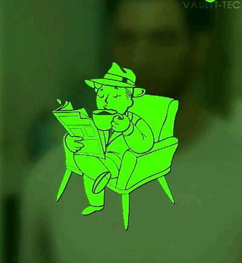
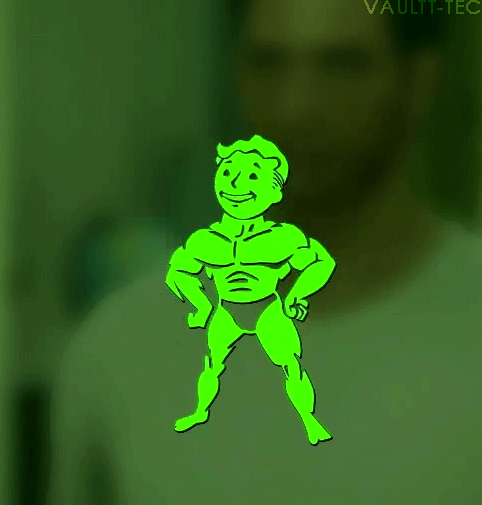
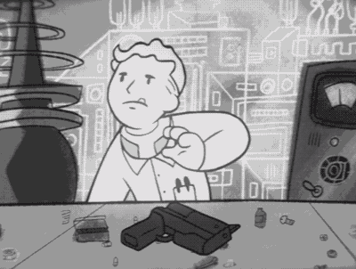

  

<h1 align="center" font-size="50px"> <b>------ CyberNotPunk ------</b> </h1> 
 

 
<h2>------ About Me ------</h2> 

Always been a geek (even when it wasn't cool). Hooked to cyber since WatchDogs (back when Ubisoft was relevant). IBM Addict and peace enjoyer

 
<h2>------ My Skills ------</h2>

  

  
<h2>------ Frameworks ------</h2>

  

  
<h2>------ Why ------</h2>

Because I  strongly believe that the Internet should be safe and free from anyone with bad intentions, that tools for protecting your digital activity should be free and easy to use

  
<h1>See you on the Net and browse safely baby</h1>

